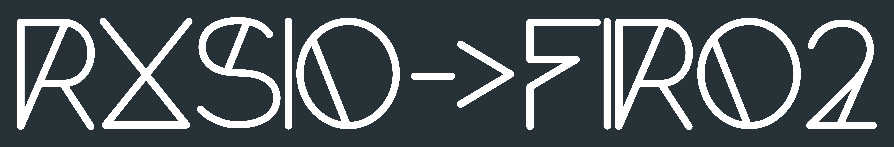

This repository contains graphics and information related to the visual appearenece of RXSIO and FIRO.

### Font

Both logos are created using the [Forte font](https://www.dafont.com/forte.font) by Paul Kritzmire.

### Color

The color of logo backgrounds is #263238, which is Blue Grey 900 from Google's Material Design color palette.

## Usage Guidelines for RXSIO Visual Identity

### 1. Purpose
We aim to promote the creative use of RXSIO's visual identity, including for commercial purposes. However, we also seek to prevent misuse, particularly cases where our identity is used to mislead or imply affiliation with RXSIO. Our goal is to protect our organization and community from harm caused by misrepresentation, while remaining open to collaboration. Commercial use of our identity without explicit permission is generally restricted to avoid potential abuse. If you wish to use our identity commercially, we encourage you to seek official approval or explore opportunities to collaborate directly with RXSIO.

### 2. Definitions
"Identification" refers to all marks, logos, organization and project names, slogans, domain names, and designs created or owned by the RXSIO organization. All works in this repository are included in this definition.

### 3. General Permissions
You are permitted to use, share, and create derivative works based on our visual identity, under the following terms:

### 4. Restrictions
- You may not use RXSIO’s visual identity in the name of your business, product, service, app, domain name, publication, or other offerings.
- Do not use our identity in a manner that implies affiliation, endorsement, or sponsorship by RXSIO.
- Our visual identity should not appear more prominently than your own product, service, or company name.
- Commercial usage of RXSIO's identity is prohibited unless it is either (a) a truthful, descriptive reference, or (b) explicitly approved by RXSIO.

### 5. Derivative Works
By creating derivative works based on RXSIO’s visual identity, you grant us full rights to:
- Use, share, and distribute your derivative works, including for commercial applications.
- Create further derivative works based on your derivative, under the same rights.

### 6. Revocation of Rights
RXSIO reserves the right to revoke, at any time and without explanation, the following:
- Permission to use or share any part of our original visual identity.
- Permission to create, use, or share any derivative works based on our visual identity.

### 7. Future Trademarks
If any part of RXSIO’s identity is registered as a trademark in the future, the trademark policy will supersede these guidelines.

#### Acknowledgment
These guidelines are inspired by the [Mozilla Trademark Guidelines](https://www.mozilla.org/en-US/foundation/trademarks/policy/)
