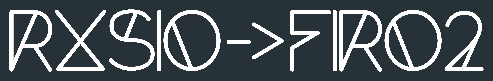

This repository contains graphics and information related to the visual appearenece of RXSIO and FIRO.

## Font

Both logos are created using the [Forte font](https://www.dafont.com/forte.font) by Paul Kritzmire.

# Color

The color of logo backgrounds is #263238, which is Blue Grey 900 from Google's Material Design color palette.
